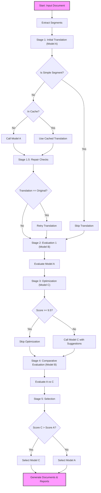

# Word Document Translation SDK

[English](README.md) | [中文](README_zh.md)

A Python SDK for translating Word documents (`.docx`) using a multi-model workflow (Translate -> Evaluate -> Optimize -> Select).

## Features

- **Multi-Model Workflow**: 
    - **Initial Translation Model**: Initial Translation
    - **Evaluation Model**: Evaluation (Accuracy, Fluency, Consistency, Terminology, Completeness)
    - **Optimization Model**: Optimization based on evaluation
    - **Selection**: Automatically selects the best translation based on scores.
- **Format Preservation**: Preserves paragraph styles, tables, and formulas.
- **Strict Language Enforcement**: Prevents accidental translation to English and ensures strict adherence to the target language.
- **Model Number Preservation**: Automatically detects and preserves alphanumeric codes and model numbers (e.g., "STR-1650").
- **Comprehensive Reporting**: Generates Excel and PDF reports with detailed evaluation metrics.
- **Bilingual Output**: Generates a bilingual document (Original + Translation) with preserved indentation and formatting.

## Workflow Overview



## Installation
 
You can install the SDK directly using `pip` or `uv`:
 
```bash
# Using pip
pip install docu-fluent
 
# Using uv
uv pip install docu-fluent
```
 
Alternatively, for development:
 
```bash
# Clone the repository
git clone <repository-url>
cd DocuFluent
 
# Install dependencies
uv sync
```

## Usage

### Command Line Interface (CLI)

You can use the SDK directly from the command line.

```bash
# Set up your API key (if using OpenAI)
export OPENAI_API_KEY="your-api-key"

# Run translation with Azure OpenAI
uv run python -m docu_fluent input.docx \
    --output-dir output \
    --provider azure \
    --base-url https://your-resource.openai.azure.com/ \
    --api-key your-azure-key \
    --api-version 2023-05-15 \
    --model-translation gpt-35-turbo-deployment \
    --model-evaluation gpt-4-deployment \
    --model-optimization gpt-4-deployment \
    --source-lang auto \
    --target-lang "French"
```

**Arguments:**

- `input_file`: Path to the `.docx` file to translate.
- `--output-dir`: Directory to save the output files (default: `output`).
- `--provider`: LLM provider to use (`openai`, `azure`, or `mock`). Default is `mock`.
- `--api-key`: API key for the provider.
- `--base-url`: Base URL (OpenAI) or Azure Endpoint (Azure).
- `--api-version`: API Version (Azure only, e.g., `2023-05-15`).
- `--model-translation`: Model/Deployment for translation.
- `--model-evaluation`: Model/Deployment for evaluation.
- `--model-optimization`: Model/Deployment for optimization.
- `--source-lang`: Source language (default: `auto`).
- `--target-lang`: Target language (default: `Chinese`).
- `--config`: Path to a JSON configuration file (e.g., `model_config.json`). If provided, model arguments are ignored.

### Quick Start with Configuration File

For easier usage, you can configure your models in `model_config.json` and use the `translate.py` script.

1.  **Configure Models**: Create or edit `model_config.json`:
    ```json
    {
        "translation_config": {
            "provider": "openai",
            "api_key": "sk-...",
            "base_url": "https://api.openai.com/v1",
            "model": "gpt-3.5-turbo"
        },
        "evaluation_config": {
            "provider": "openai",
            "api_key": "sk-...",
            "base_url": "https://api.openai.com/v1",
            "model": "gpt-4"
        },
        "optimization_config": {
            "provider": "openai",
            "api_key": "sk-...",
            "base_url": "https://api.openai.com/v1",
            "model": "gpt-4"
        },
        "concurrency_config": {
            "translation": 32,
            "evaluation_1": 32,
            "optimization": 32,
            "evaluation_2": 32
        }
    }
    ```

2.  **Run Translation**:
    ```bash
    uv run python -m docu_fluent input.docx --config model_config.json --target-lang "Chinese"
    ```

### Web Interface (GUI)

You can launch a user-friendly web interface to run translations without using the command line arguments.

**Launch Command:**
```bash
# Using the test script
uv run python translate.py --gui

# OR using the main SDK module (if installed)
uv run python -m docu_fluent --gui
```

**Features:**
-   **File Upload**: Drag and drop `.docx` files.
-   **Language Selection**: Select source (auto-detect supported) and target languages from a dropdown.
-   **Settings (JSON)**: Directly edit the `model_config.json` content in the "Settings" tab to configure:
    -   **Models**: Provider, API Key, Base URL, and Model Name for each stage (Translation, Evaluation, Optimization).
    -   **Concurrency**: Number of parallel workers for each stage.
-   **Progress Tracking**: Real-time progress bars for translation, evaluation, and optimization stages.
-   **Downloads**: Download all generated files (Translated Doc, Bilingual Doc, Reports, JSON Logs) directly from the browser.

### Python SDK

You can also use the SDK in your Python code.

```python
from docu_fluent.sdk import TranslationSDK

# Initialize SDK with specific configurations for each model
# This allows using different providers/models for each step
# Initialize SDK with specific configurations for each model
# This allows using different providers/models for each step
sdk = TranslationSDK(
    translation_config={
        "provider": "openai",
        "api_key": "key-for-provider-1",
        "base_url": "https://api.provider1.com/v1",
        "model": "model-name-1"
    },
    evaluation_config={
        "provider": "openai",
        "api_key": "key-for-provider-2",
        "base_url": "https://api.provider2.com/v1",
        "model": "model-name-2"
    },
    optimization_config={
        "provider": "azure",
        "api_key": "azure-key",
        "base_url": "https://your-resource.openai.azure.com/",
        "api_version": "2023-05-15",
        "model": "gpt-4-deployment"
    }
)

# Translate a document
sdk.translate_document(
    "path/to/document.docx", 
    output_dir="output",
    source_lang="English",
    target_lang="Spanish"
)
```

### Regenerating Documents

If you need to make manual corrections, you can edit the generated Excel report (`{filename}_report.xlsx`) and then regenerate the documents.

1.  Open the Excel report.
2.  (Optional) Add a column named `final_translation` with your corrected text.
3.  Run the regeneration script:

```bash
uv run python regenerate_docs.py \
    --input-docx "path/to/original.docx" \
    --input-excel "path/to/edited_report.xlsx" \
    --output-dir "output_folder"
```

This will generate:
- `{filename}_regenerated_translated.docx`
- `{filename}_regenerated_bilingual.docx`


## Output Files

The SDK generates the following files in the output directory:

1.  `{filename}_translated.docx`: The fully translated document.
2.  `{filename}_bilingual.docx`: A document with both original and translated text.
3.  `{filename}_report.xlsx`: An Excel file containing detailed scores for each segment across 5 dimensions.
4.  `{filename}_report.pdf`: A PDF summary of the translation quality.
5.  `{filename}_usage.json`: Token usage statistics for the translation task.
6.  `{filename}_model_mapping.json`: Mapping of model aliases (A, B, C) to actual model names used.
7.  `{filename}_results.json`: Full detailed results including all intermediate steps and raw LLM responses.

## Evaluation Dimensions

The translation is evaluated on 5 dimensions (0-10 score):
1.  **Accuracy**: How accurately the meaning is conveyed.
2.  **Fluency**: How natural the translation sounds.
3.  **Consistency**: Consistency of terminology and style.
4.  **Terminology**: Accuracy of specific domain terms.
5.  **Completeness**: Whether all content is translated.

## License

This project is licensed under the **GNU Affero General Public License v3.0 (AGPLv3)**.

See the [LICENSE](LICENSE) file for details.
