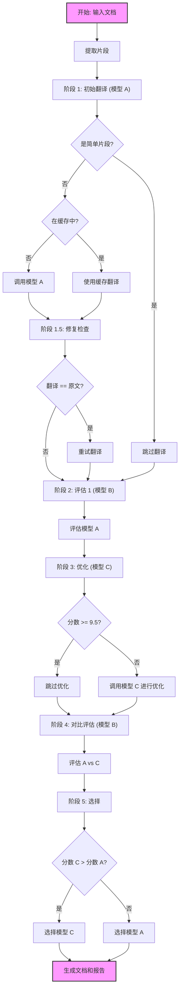

# Word 文档翻译 SDK

[English](README.md) | [中文](README_zh.md)

一个用于翻译 Word 文档 (`.docx`) 的 Python SDK，使用多模型工作流（翻译 -> 评估 -> 优化 -> 选择）。

## 功能特性

- **多模型工作流**: 
    - **初始翻译模型**: 初始翻译
    - **评估模型**: 评估（准确性、流畅性、一致性、术语、完整性）
    - **优化模型**: 基于评估进行优化
    - **选择**: 根据评分自动选择最佳翻译
- **格式保留**: 保留段落样式、表格和公式。
- **严格语言强制**: 防止意外翻译成英语，确保严格遵守目标语言。
- **型号保留**: 自动检测并保留字母数字代码和型号（例如 "STR-1650"）。
- **综合报告**: 生成包含详细评估指标的 Excel 和 PDF 报告。
- **双语输出**: 生成双语文档（原文 + 译文），并保留缩进和格式。

## 工作流概览



## 安装 (Installation)

您可以直接使用 `pip` 或 `uv` 安装 SDK：

```bash
# 使用 pip
pip install docu-fluent

# 使用 uv
uv pip install docu-fluent
```

或者，用于开发：

```bash
# 克隆仓库
git clone <repository-url>
cd DocuFluent

# 安装依赖
uv sync
```

## 使用方法

### 命令行接口 (CLI)

你可以直接从命令行使用 SDK。

```bash
# 设置 API Key (如果使用 OpenAI)
export OPENAI_API_KEY="your-api-key"

# 使用 Azure OpenAI 运行翻译
uv run python -m docu_fluent input.docx \
    --output-dir output \
    --provider azure \
    --base-url https://your-resource.openai.azure.com/ \
    --api-key your-azure-key \
    --api-version 2023-05-15 \
    --model-translation gpt-35-turbo-deployment \
    --model-evaluation gpt-4-deployment \
    --model-optimization gpt-4-deployment \
    --source-lang auto \
    --target-lang "Chinese"
```

**参数:**

- `input_file`: 要翻译的 `.docx` 文件路径。
- `--output-dir`: 保存输出文件的目录 (默认: `output`)。
- `--provider`: 使用的 LLM 提供商 (`openai`, `azure`, 或 `mock`)。默认为 `mock`。
- `--api-key`: 提供商的 API Key。
- `--base-url`: Base URL (OpenAI) 或 Azure Endpoint (Azure)。
- `--api-version`: API 版本 (仅限 Azure, 例如 `2023-05-15`)。
- `--model-translation`: 翻译模型/部署。
- `--model-evaluation`: 评估模型/部署。
- `--model-optimization`: 优化模型/部署。
- `--source-lang`: 源语言 (默认: `auto`)。
- `--target-lang`: 目标语言 (默认: `Chinese`)。
- `--config`: JSON 配置文件路径 (例如 `model_config.json`)。如果提供，将忽略命令行中的模型参数。

### 使用配置文件快速开始

为了更方便使用，你可以在 `model_config.json` 中配置模型，然后使用 `translate.py` 脚本。

1.  **配置模型**: 创建或编辑 `model_config.json`:
    ```json
    {
        "translation_config": {
            "provider": "openai",
            "api_key": "sk-...",
            "base_url": "https://api.openai.com/v1",
            "model": "gpt-3.5-turbo"
        },
        "evaluation_config": {
            "provider": "openai",
            "api_key": "sk-...",
            "base_url": "https://api.openai.com/v1",
            "model": "gpt-4"
        },
        "optimization_config": {
            "provider": "openai",
            "api_key": "sk-...",
            "base_url": "https://api.openai.com/v1",
            "model": "gpt-4"
        },
        "concurrency_config": {
            "translation": 32,
            "evaluation_1": 32,
            "optimization": 32,
            "evaluation_2": 32
        }
    }
    ```

2.  **运行翻译**:
    ```bash
    uv run python -m docu_fluent input.docx --config model_config.json --target-lang "Chinese"
    ```

### Web 界面 (GUI)

你可以启动一个用户友好的 Web 界面来运行翻译，无需使用命令行参数。

**启动命令:**
```bash
# 使用测试脚本
uv run python translate.py --gui
 
# 或者使用主 SDK 模块 (如果已安装)
uv run python -m docu_fluent --gui
```

**功能:**
-   **文件上传**: 拖拽上传 `.docx` 文件。
-   **语言选择**: 从下拉菜单选择源语言（支持自动检测）和目标语言。
-   **设置 (JSON)**: 在“设置”标签页中直接编辑 `model_config.json` 内容以配置：
    -   **模型**: 每个阶段（翻译、评估、优化）的提供商、API Key、Base URL 和模型名称。
    -   **并发**: 每个阶段的并行工作线程数。
-   **进度追踪**: 实时显示翻译、评估和优化阶段的进度条。
-   **下载**: 直接从浏览器下载所有生成的文件（翻译文档、双语文档、报告、JSON 日志）。

### Python SDK

你也可以在 Python 代码中使用 SDK。

```python
from docu_fluent.sdk import TranslationSDK

# 初始化 SDK，为每个模型配置特定的参数
# 这允许在每个步骤使用不同的提供商/模型
sdk = TranslationSDK(
    translation_config={
        "provider": "openai",
        "api_key": "key-for-provider-1",
        "base_url": "https://api.provider1.com/v1",
        "model": "model-name-1"
    },
    evaluation_config={
        "provider": "openai",
        "api_key": "key-for-provider-2",
        "base_url": "https://api.provider2.com/v1",
        "model": "model-name-2"
    },
    optimization_config={
        "provider": "azure",
        "api_key": "azure-key",
        "base_url": "https://your-resource.openai.azure.com/",
        "api_version": "2023-05-15",
        "model": "gpt-4-deployment"
    }
)

# 翻译文档
sdk.translate_document(
    "path/to/document.docx", 
    output_dir="output",
    source_lang="English",
    target_lang="Spanish"
)
```

### 重新生成文档

如果你需要进行手动修正，可以编辑生成的 Excel 报告 (`{filename}_report.xlsx`)，然后重新生成文档。

1.  打开 Excel 报告。
2.  (可选) 添加名为 `final_translation` 的列，填入你的修正文本。
3.  运行重新生成脚本:

```bash
uv run python regenerate_docs.py \
    --input-docx "path/to/original.docx" \
    --input-excel "path/to/edited_report.xlsx" \
    --output-dir "output_folder"
```

这将生成:
- `{filename}_regenerated_translated.docx`
- `{filename}_regenerated_bilingual.docx`


## 输出文件

SDK 在输出目录中生成以下文件:

1.  `{filename}_translated.docx`: 完全翻译的文档。
2.  `{filename}_bilingual.docx`: 包含原文和译文的文档。
3.  `{filename}_report.xlsx`: 包含每个片段在 5 个维度上详细评分的 Excel 文件。
4.  `{filename}_report.pdf`: 翻译质量的 PDF 摘要。
5.  `{filename}_usage.json`: 翻译任务的 Token 使用统计。
6.  `{filename}_model_mapping.json`: 模型别名 (A, B, C) 到实际使用的模型名称的映射。
7.  `{filename}_results.json`: 包含所有中间步骤和原始 LLM 响应的完整详细结果。

## 评估维度

翻译在 5 个维度上进行评估 (0-10 分):
1.  **准确性 (Accuracy)**: 含义传达的准确程度。
2.  **流畅性 (Fluency)**: 翻译听起来是否自然。
3.  **一致性 (Consistency)**: 术语和风格的一致性。
4.  **术语 (Terminology)**: 特定领域术语的准确性。
5.  **完整性 (Completeness)**: 是否所有内容都已翻译。

## 许可协议 (License)

本项目采用 **GNU Affero General Public License v3.0 (AGPLv3)** 许可协议。

详情请参阅 [LICENSE](LICENSE) 文件。
